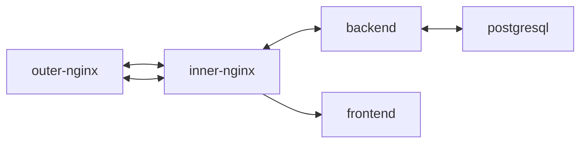

[Развёрнутый проект](https://hixfoodgram.hopto.org/recipes)
### Стек использованных технологий


### Проект «Фудграм»
##### Проект «Фудграм» — вебсайт, на котором пользователи будут публиковать свои рецепты, добавлять рецепты других пользователей в избранное и подписываться на публикации авторов. Зарегистрированным пользователям также будет доступен сервис «Список покупок». Он позволит создавать список продуктов, которые нужно купить для приготовления выбранных блюд.


### Как развернуть проект на удаленном сервере

1. Форкнуть репозиторий в свой GitHub и склонировать его:

    ```bash
    git clone https://github.com/<username>/foodgram
    ```

2. Добавить следующие secrets в settings своего репозитория:

    - `ALLOWED_HOSTS` # список хостов, которые могут отправлять запрос на бэкенд
    - `SECRET_KEY` # значение переменной SECRET_KEY
    - `DOCKER_NAME` # никнейм в DockerHub
    - `DOCKER_PASSWORD` # пароль пользователя в DockerHub
    - `DOCKER_USERNAME` # имя пользователя в DockerHub
    - `HOST` # IP-адрес удаленного сервера
    - `SETTINGS_DEBUG` # значение переменной SETTINGS True/False
    - `SSH_KEY` # приватный ssh-ключ сервера
    - `SSH_PASSPHRASE` # кодовая фраза (пароль) для ssh-ключа
    - `TELEGRAM_ID` # ID пользователя в Telegram
    - `TELEGRAM_TOKEN` # токен телеграм-бота
    - `USER` # логин на удаленном сервере

3. Создать Docker-образы

    ```bash
    cd foodgram
    cd frontend
    docker build -t username/foodgram-frontend .
    cd ../backend
    docker build -t username/foodgram-backend .
    ```

4. Загрузить образы на DockerHub

    ```bash
    docker push username/foodgram-frontend
    docker push username/foodgram-backend
    ```

5. Создать папку `foodgram` на вашем сервере и скопировать в нее:

    - `.env`, добавьте в него переменные из списка в файле `.env.example` в корне проекта
    - Создать папку `infra` в папке `foodgram` и скопировать в нее `docker-compose.production.yml`

6. Запустить docker compose в режиме демона:

    ```bash
    sudo docker compose -f docker-compose.production.yml up -d
    ```

7. Выполнить миграции, собрать статику бэкенда и скопировать их в `/static/static/`:

    ```bash
    sudo docker compose -f docker-compose.production.yml exec backend python manage.py migrate
    sudo docker compose -f docker-compose.production.yml exec backend python manage.py collectstatic
    sudo docker compose -f docker-compose.production.yml exec backend cp -r /app/static/. /backend_static/
    ```


8. Изменить конфиг Nginx в зависимости от имеющегося. Например:

    ```bash
    sudo nano /etc/nginx/sites-enabled/default
    ```

    ```nginx
    location / {
        proxy_set_header Host $http_host;
        proxy_pass http://127.0.0.1:8000;
    }
    ```

9. Проверить конфиг Nginx и перезапустить его:

    ```bash
    sudo nginx -t
    sudo service nginx reload
    ```

## Настройка CI/CD

1. Файл workflow уже написан. Он находится в директории

    ```text
    foodgram/.github/workflows/main.yml
    ```

2. После пуша в ветку `main` будут выполнены следующие джобы:

    - проверка кода на соответствие PEP8 (с помощью пакета flake8)
    - билд и пуш контейнеров frontend и backend на DockerHub
    - деплой на удаленный сервер
    - при успешном деплое отправка сообщения в Telegram с информацией об успешном деплое


#### Автор: [Баринов Станислав](https://github.com/hix9)
